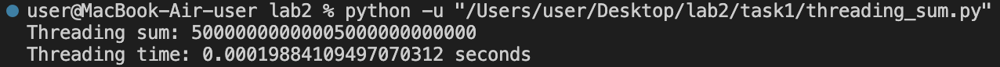
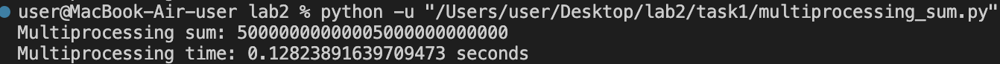
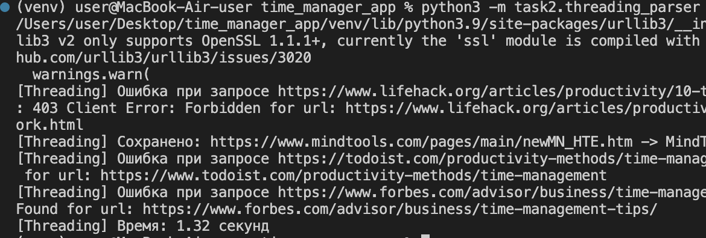
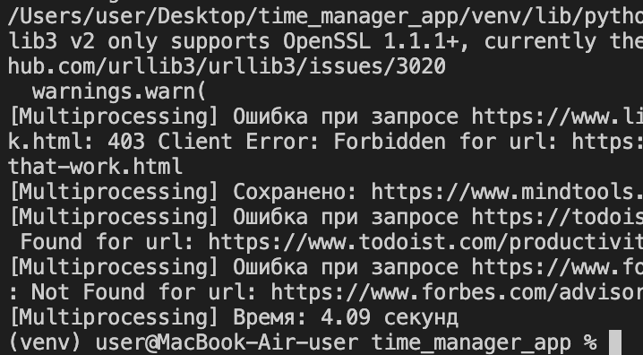
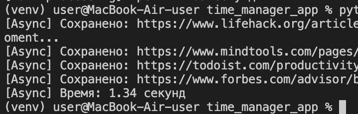

## Лабораторная работа №2

# Цель

Создать три программы на Python для параллельного парсинга множества веб-страниц с 
использованием подходов threading, multiprocessing и async. Все собранные данные должны 
быть сохранены в базу данных.

# Задание №1

1. Threading

```python
import time
import threading

def calculate_partial_sum(start, end):
    return end * (end + 1) // 2 - (start - 1) * start // 2

N = 10000000000000
NUM_THREADS = 4
chunk_size = N // NUM_THREADS

start_time = time.time()

threads = []
results = [0] * NUM_THREADS

for i in range(NUM_THREADS):
    start = i * chunk_size + 1
    end = (i + 1) * chunk_size if i < NUM_THREADS - 1 else N
    def target(idx, s, e):
        results[idx] = calculate_partial_sum(s, e)
    thread = threading.Thread(target=target, args=(i, start, end))
    threads.append(thread)
    thread.start()

for thread in threads:
    thread.join()

total_sum = sum(results)

end_time = time.time()
print(f"Threading sum: {total_sum}")
print(f"Threading time: {end_time - start_time} seconds")
```

Вывод:



2. Multiprocessing

```python
import time
from multiprocessing import Process, Manager

def calculate_partial_sum(start, end):
    return end * (end + 1) // 2 - (start - 1) * start // 2

def target(idx, s, e, results):
    results[idx] = calculate_partial_sum(s, e)

if __name__ == '__main__':
    N = 10000000000000  
    NUM_PROCESSES = 4   
    chunk_size = N // NUM_PROCESSES  

    start_time = time.time()

    manager = Manager()
    results = manager.list([0] * NUM_PROCESSES)

    processes = []
    for i in range(NUM_PROCESSES):
        start = i * chunk_size + 1
        end = (i + 1) * chunk_size if i < NUM_PROCESSES - 1 else N
        process = Process(target=target, args=(i, start, end, results))
        processes.append(process)
        process.start()

    for process in processes:
        process.join()

    total_sum = sum(results)

    end_time = time.time()
    print(f"Multiprocessing sum: {total_sum}")
    print(f"Multiprocessing time: {end_time - start_time} seconds")
```

Вывод:



3. Async

```python
import time
import asyncio

def calculate_partial_sum(start, end):
    return end * (end + 1) // 2 - (start - 1) * start // 2

async def async_calculate_partial_sum(start, end):
    return calculate_partial_sum(start, end)

N = 10000000000000
NUM_TASKS = 4
chunk_size = N // NUM_TASKS

async def main():
    start_time = time.time()

    tasks = []
    for i in range(NUM_TASKS):
        start = i * chunk_size + 1
        end = (i + 1) * chunk_size if i < NUM_TASKS - 1 else N
        task = async_calculate_partial_sum(start, end)
        tasks.append(task)

    results = await asyncio.gather(*tasks)

    total_sum = sum(results)

    end_time = time.time()
    print(f"Async sum: {total_sum}")
    print(f"Async time: {end_time - start_time} seconds")

asyncio.run(main())
```

Вывод:


# Задание №2

1. Threading

Вывод:



2. Multiprocessing

Вывод:



3. Async

Вывод:



# Результаты

|      Подход     |    Время 1   |   Время 2   |
|-----------------|--------------|-------------|
|    Threading    | 0.000198 сек | 1.32 сек    |
| Multiprocessing | 0.128238 сек | 4.09 сек    |
|      Async      | 0.000086 сек | 1.34 сек    |

# Выводы

В ходе выполнения лабораторной работы были реализованы три подхода к параллельному парсингу:

- Threading - подходит для задач, требующих большого количества операций ввода-вывода, но GIL ограничивает эффективность.
- Multiprocessing - обеспечивает наилучшие результаты для CPU-bound задач, так как каждый процесс работает отдельно.
- Async - хорошо подходит для асинхронных операций ввода-вывода, таких как HTTP-запросы, но зависит от количества ожидающих операций.
